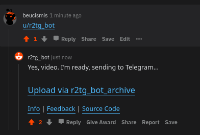

  

A Reddit bot that uploads video or GIF files to Telegram. Just mention me (`u/r2tg_bot`) in the comments. All requests are upload to archive channel by default. NSFW etc. content is not allowed on default channel. If you liked me, reply to my answer saying "**good bot**".

Reddit bot: https://reddit.com/u/r2tg_bot <br/>
Telegram bot: https://t.me/r2tg_bot <br/>
Archive channel: https://t.me/s/r2tg_bot_archive

<details>
  <summary>Show the demo</summary>

</details>

## Features

- Fast and easy
- Customizable
- Self-hosted
- Trigger with comment
- Video and GIF upload
- Written in Python

## Installation

### Requirements

It use [FFmpeg](https://ffmpeg.org) to merge downloaded video and audio.

* Python: `3.7+`
* Dependencies:
  * Debian, Ubuntu: `ffmpeg`
  * Fedora: `ffmpeg`
  * Arch Linux: `ffmpeg4.0`
  * CentOS: `ffmpeg`

### Manual

#### From source

1. Clone the reporistrory.
```sh
git clone https://github.com/beucismis/r2tg_bot && cd r2tg_bot/
```

2. Install dependencies.
```sh
pip3 install -r requirements.txt --user
```

3. Build the project.
```sh
python3 install setup.py
```

## Configuration File

Soon...

## License
This project lisanced under GPL-3.0 - for details check [LICENSE](LICENSE) file.
