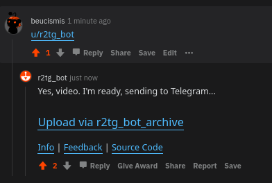

 

A Reddit bot that uploads video or GIF files to Telegram. Just mention me (`u/r2tg_bot`) in the comments.

Reddit bot: https://reddit.com/u/r2tg_bot <br/>
Telegram bot: https://t.me/r2tg_bot <br/>
Archive channel: https://t.me/s/r2tg_bot_archive

## Features
- Fast and easy
- Trigger with comment
- Video and GIF upload
- Self-hosted
- Only GNU/Linux
- Written in Python

## Dependencies
I use [FFmpeg](https://ffmpeg.org) to download videos and GIFs.
  * Debian based systems: `$ apt install ffmpeg`
  * Arch Linux based systems: `$ pacman -S ffmpeg4.0`
  * CentOS based systems: `$ yum install ffmpeg`

## Installation and Configuration

### Installing the sources
1. Clone the reporistrory: 
```sh
$ git clone https://github.com/beucismis/r2tg_bot
$ cd r2tg_bot/
```
2. Install dependencies:
```sh
$ pip3 install -r requirements.txt
```

## License
This project lisanced under GPL-3.0 - for details check [LICENSE](LICENSE) file.
